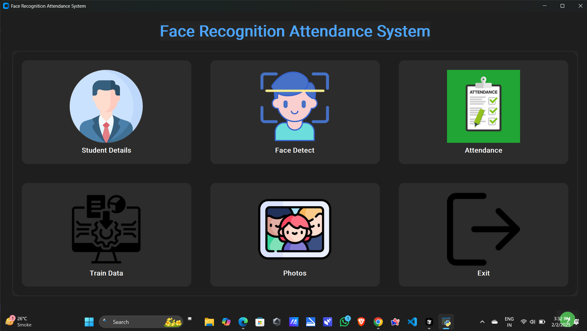
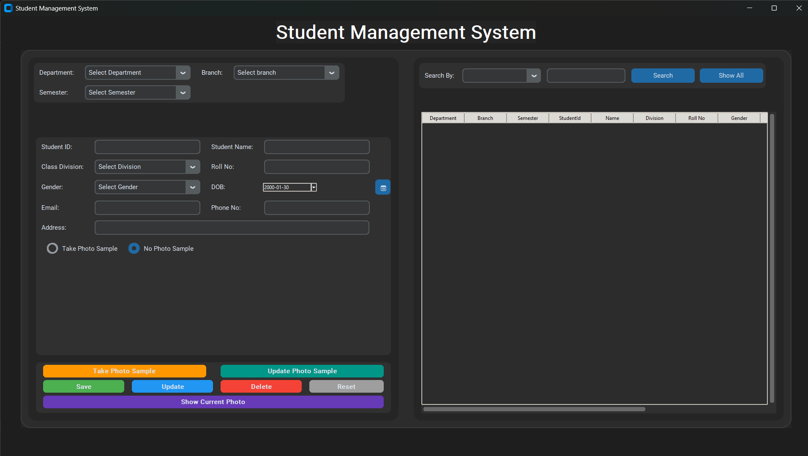
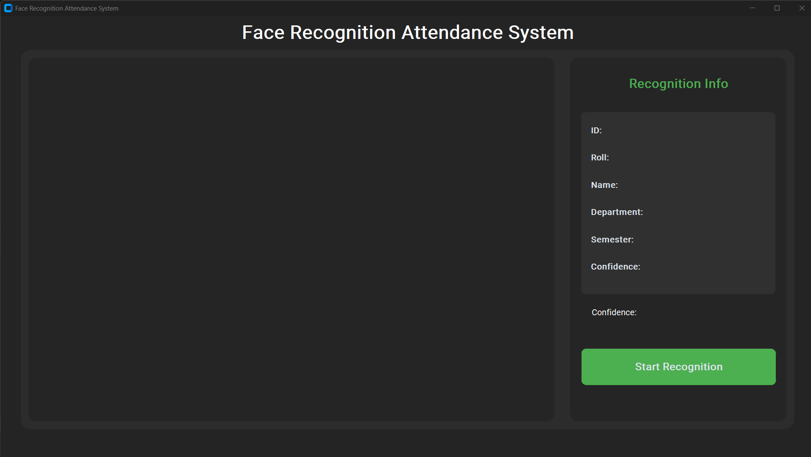
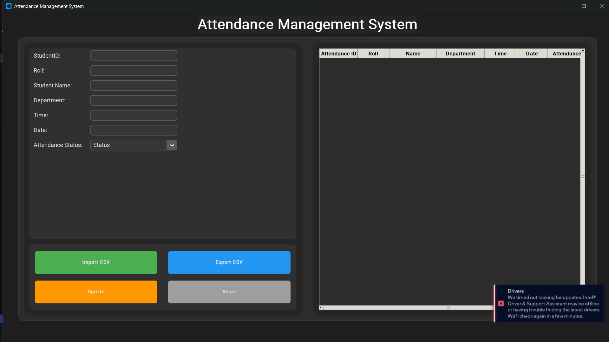
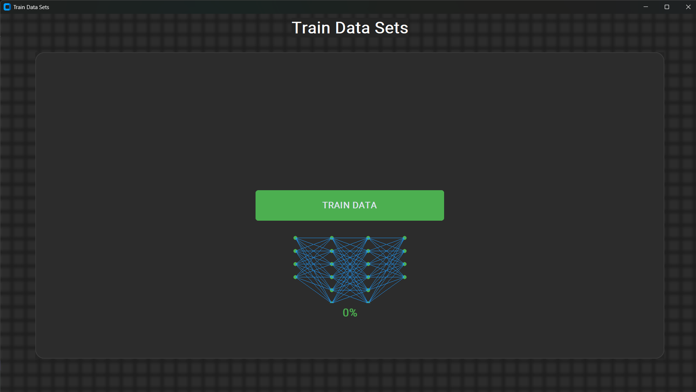
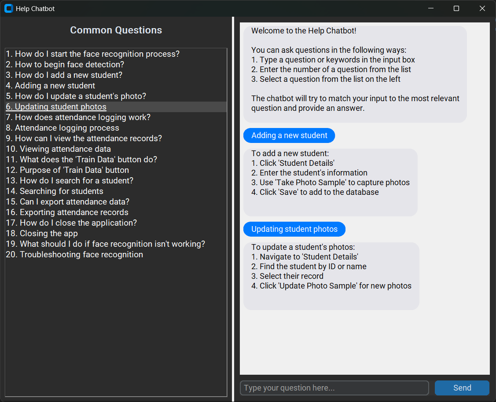

# SmartAttend Pro

<div align="center">



A modern face recognition-based attendance system built with Python and OpenCV, featuring a sleek dark-themed UI.

[](https://www.python.org/)
[](https://opencv.org/)
[](https://www.mysql.com/)
[](LICENSE)

</div>

## 🌟 Key Features

### 1. Student Management
<div align="center">
  
</div>

- 📝 Complete student information management
- 🏢 Department and branch-wise organization
- 📸 Photo sample collection for face recognition
- 🔍 Intuitive search and filter capabilities
- 📤 Bulk import/export functionality

### 2. Face Recognition
<div align="center">
  
</div>

- 🎯 Real-time face detection and recognition
- ✨ High-accuracy student identification
- 📊 Confidence level indicators
- ✅ Automatic attendance marking
- 👥 Multi-face detection support

#### How it works:
1. Click the "Start Recognition" button to activate the camera
2. The system detects faces in real-time
3. When a student is recognized:
   - Their details appear in the Recognition Info panel
   - ID, Roll, Name, Department, and Semester are displayed
   - Confidence level shows the accuracy of recognition
   - Attendance is automatically marked in the CSV file
4. The system prevents duplicate entries within an hour

### 3. Attendance Management
<div align="center">
  
</div>

- ⏰ Automated attendance tracking
- 📊 CSV import/export functionality
- 🔄 Real-time attendance status updates
- 📋 Detailed attendance records
- 💼 Easy data management

### 4. Training System
<div align="center">
  
</div>

- 🧠 Neural network-based training
- 📈 Progress visualization
- 📊 Real-time accuracy metrics
- 🔄 Automated model optimization
- 📁 Dataset management

### 5. Help System
<div align="center">
  
</div>

- 💬 Interactive help chatbot
- ❓ Common questions and answers
- 📝 Step-by-step guides
- 🔍 Quick issue resolution
- 🎯 User-friendly interface

## 🛠️ Technical Features

- 🎨 Modern dark-themed UI using CustomTkinter
- 👁️ Real-time face detection using OpenCV
- 🗄️ MySQL database integration
- 🔄 Multi-threaded processing
- 📊 CSV data import/export
- 🔒 Secure authentication system
- 💾 Automated backup system

## ⚙️ Installation

1. Clone the repository:
```bash
git clone https://github.com/PatelJU/SmartAttend-Pro.git
cd SmartAttend-Pro
```

2. Create and activate a virtual environment:
```bash
# Windows
python -m venv venv
venv\Scripts\activate

# Linux/Mac
python -m venv venv
source venv/bin/activate
```

3. Install dependencies:

   For minimal installation (recommended for most users):
   ```bash
   pip install -r requirements-minimal.txt
   ```

   For full installation (including development tools):
   ```bash
   pip install -r requirements.txt
   ```

   If you encounter any issues with OpenCV, try:
   ```bash
   pip install opencv-contrib-python --no-cache-dir
   ```

4. Set up the database:
   - Install MySQL if not already installed
   - Create a new database named 'face_recognizer'
   - Run the database setup script:
   ```bash
   python src/scripts/setup_database.py
   ```

5. Configure environment variables:
```bash
# Windows
copy .env.example .env

# Linux/Mac
cp .env.example .env

# Edit .env with your database credentials:
# DB_HOST=localhost
# DB_USER=your_username
# DB_PASSWORD=your_password
# DB_NAME=face_recognizer
```

6. Verify installation:
```bash
python src/app.py
```

### Troubleshooting

If you encounter any issues:

1. OpenCV errors:
   ```bash
   pip uninstall opencv-python opencv-contrib-python
   pip install opencv-contrib-python --no-cache-dir
   ```

2. Tkinter errors:
   - Windows: Python includes Tkinter by default
   - Linux: `sudo apt-get install python3-tk`
   - Mac: `brew install python-tk`

3. MySQL Connector errors:
   ```bash
   pip uninstall mysql-connector-python
   pip install mysql-connector-python --no-cache-dir
   ```

4. CustomTkinter issues:
   ```bash
   pip install --upgrade customtkinter
   ```

## 🚀 Usage

1. Start the application:
```bash
python src/app.py
```

2. Navigate through the modules:
   - 👥 Student Details: Manage student information
   - 👁️ Face Detect: Start face recognition
   - ✅ Attendance: View and manage attendance
   - 🧠 Train Data: Train the recognition model
   - 📸 Photos: View captured photos

## 💻 System Requirements

- Python 3.8+
- OpenCV with contrib modules
- MySQL/MariaDB
- Webcam

## 🤝 Contributing

Please read [CONTRIBUTING.md](CONTRIBUTING.md) for details on our code of conduct and the process for submitting pull requests.

## 📝 License

This project is licensed under the MIT License - see the [LICENSE](LICENSE) file for details.

## 🙏 Acknowledgments

- OpenCV team for face recognition modules
- CustomTkinter for modern UI components
- All contributors who have helped with testing and improvements

## 📞 Contact

- Project Link: [https://github.com/PatelJU/SmartAttend-Pro](https://github.com/PatelJU/SmartAttend-Pro) 
