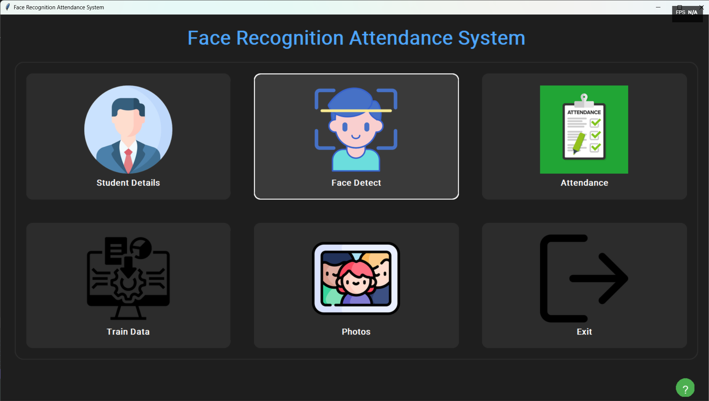
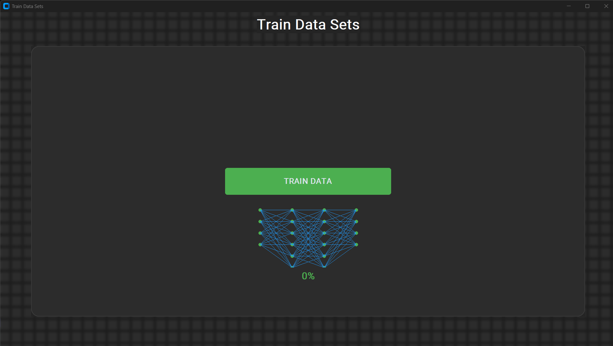

# SmartAttend Pro

A modern face recognition-based attendance system built with Python and OpenCV, featuring a sleek dark-themed UI.



## Key Features

### 1. Student Management

- Complete student information management
- Department and branch-wise organization
- Photo sample collection for face recognition
- Intuitive search and filter capabilities
- Bulk import/export functionality

### 2. Face Recognition
- Real-time face detection and recognition
- High-accuracy student identification
- Confidence level indicators
- Automatic attendance marking
- Multi-face detection support

### 3. Attendance Management

- Automated attendance tracking
- CSV import/export functionality
- Real-time attendance status updates
- Detailed attendance records
- Easy data management

### 4. Training System

- Neural network-based training
- Progress visualization
- Real-time accuracy metrics
- Automated model optimization
- Dataset management

### 5. Help System

- Interactive help chatbot
- Common questions and answers
- Step-by-step guides
- Quick issue resolution
- User-friendly interface

## Technical Features

- Modern dark-themed UI using CustomTkinter
- Real-time face detection using OpenCV
- MySQL database integration
- Multi-threaded processing
- CSV data import/export
- Secure authentication system
- Automated backup system

## Installation

1. Clone the repository:
```bash
git clone https://github.com/PatelJU/SmartAttend-Pro.git
cd SmartAttend-Pro
```

2. Create and activate a virtual environment:
```bash
python -m venv venv
# Windows
venv\Scripts\activate
# Linux/Mac
source venv/bin/activate
```

3. Install dependencies:
```bash
pip install -r requirements.txt
```

4. Set up the database:
```bash
python src/scripts/setup_database.py
```

5. Configure environment variables:
```bash
cp .env.example .env
# Edit .env with your database credentials
```

## Usage

1. Start the application:
```bash
python src/app.py
```

2. Navigate through the modules:
   - Student Details: Manage student information
   - Face Detect: Start face recognition
   - Attendance: View and manage attendance
   - Train Data: Train the recognition model
   - Photos: View captured photos

## System Requirements

- Python 3.8+
- OpenCV with contrib modules
- MySQL/MariaDB
- Webcam

## Contributing

Please read [CONTRIBUTING.md](CONTRIBUTING.md) for details on our code of conduct and the process for submitting pull requests.

## License

This project is licensed under the MIT License - see the [LICENSE](LICENSE) file for details.

## Acknowledgments

- OpenCV team for face recognition modules
- CustomTkinter for modern UI components
- All contributors who have helped with testing and improvements

## Contact

- Project Link: [https://github.com/PatelJU/SmartAttend-Pro](https://github.com/PatelJU/SmartAttend-Pro) 
